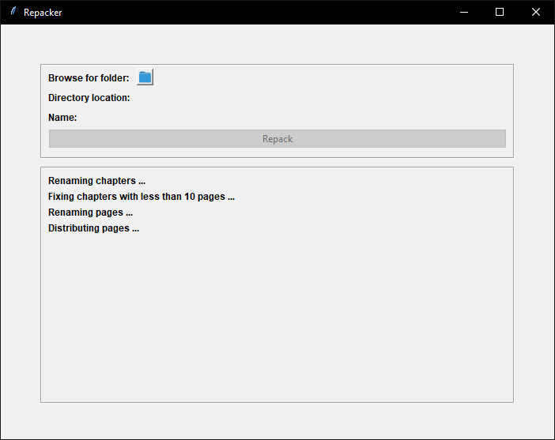

# 📜  Repacker

 Repacker is a quick formatting tool primarily developed for repacking panels into more mobile-friendly form.

# √ Prerequisites

The following requirements are needed:
- numpy 1.23.0
- Pillow 9.4.0

Install requirements via pip:

`pip install -r requirements.txt`

# ⚠️ Limitations

The app will work on directories containing chapters specifically named `Chapter 1`, `Chapter 2` etc. Numbers aren't required to be integers. Panel files must be `.jpg`, `.png` or `.webp` extensions.

In all other cases program may not work at all.

# 💡 Philosophy

 Repacker was created for packing panels into form easily readable with [Librera](https://librera.mobi/).

# 🧬 How It Works

The app functionality consists of four stages:
- Chapters Renaming - renames chapters to integers only,
- Fixing Under-ten-panels Chapters - plants buffers to chapters with less than 10 panels,
- Panels Renaming - puts files from all chapters in one folder and renames them in ascending order,
- Panels Distribution - distributes panels in bigger folders (1000 panels per folder).

# 📖 License
[MIT](https://choosealicense.com/licenses/mit/)